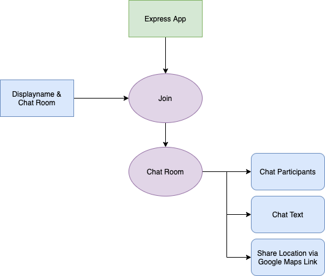

# Chat Application

A Chat Application using Express and Socket.io (Web Sockets) lets users join with simple displaynames and create chat rooms.

### **Dependancies:**

1. Socket.io
2. Mustache templating engine
3. Query String Parser
4. Moments.js
5. bad-words (profanity check)

### **Flowchart**:

